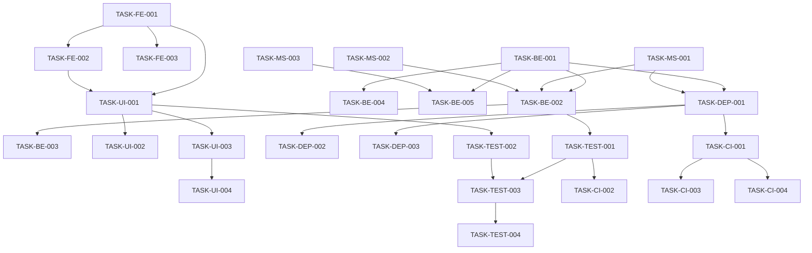

# LangChain合规助手项目任务列表

## 项目概述
- **项目名称**: LangChain智能合规助手
- **版本**: 1.0.0
- **创建日期**: 2024-01-09
- **最后更新**: 2024-01-09

## 任务状态定义
- 📋 **TODO**: 待开始
- 🚧 **IN_PROGRESS**: 进行中
- ✅ **COMPLETED**: 已完成
- 🔍 **REVIEW**: 审查中
- ❌ **BLOCKED**: 阻塞
- 🗓️ **SCHEDULED**: 已计划

## 优先级定义
- 🔴 **P0**: 紧急且重要（阻塞其他任务）
- 🟠 **P1**: 重要（核心功能）
- 🟡 **P2**: 一般（增强功能）
- 🟢 **P3**: 低（优化改进）

---

## 1. 前端设计任务

### TASK-FE-001
- **任务描述**: 设计React应用整体架构和组件结构
- **任务类型**: 架构设计
- **优先级**: 🔴 P0
- **状态**: ✅ COMPLETED
- **负责人**: Frontend Architect
- **预计工时**: 16h
- **实际工时**: 1h
- **完成时间**: 2024-01-09

**输入**:
- 参考文档: `docs/LANGCHAIN_COMPLIANCE_ASSISTANT_DESIGN.md`
- UI/UX设计：请直接参考Dify智能助手的对话界面，需包含文件上传和文本输入对话框的交互界面
- 业务需求文档：参考`/docs/DIFY_APPLICATION_DESIGN.md`和`/docs/LANGCHAIN_COMPLIANCE_ASSISTANT_DESIGN.md`

**预期输出**:
```
frontend/
├── src/
│   ├── components/        # React组件
│   ├── pages/            # 页面组件
│   ├── hooks/            # 自定义Hooks
│   ├── contexts/         # Context Providers
│   ├── services/         # API服务
│   ├── utils/            # 工具函数
│   └── types/            # TypeScript类型定义
├── package.json
└── tsconfig.json
```

**任务记录**:
```yaml
status_changes:
  - date: 2024-01-09
    from: null
    to: TODO
    by: System
  - date: 2024-01-09
    from: TODO
    to: IN_PROGRESS
    by: Auto-Task
  - date: 2024-01-09
    from: IN_PROGRESS
    to: COMPLETED
    by: Auto-Task
commits:
  - message: "feat: Setup React frontend architecture with TypeScript, Vite, Material-UI"
    files: 20
    additions: 800+
```

---

### TASK-FE-002
- **任务描述**: 设计和实现Material-UI主题系统
- **任务类型**: UI设计
- **优先级**: 🟠 P1
- **状态**: ✅ COMPLETED
- **负责人**: UI Designer
- **预计工时**: 8h
- **实际工时**: 0.5h
- **完成时间**: 2024-01-09

**输入**:
- Material-UI文档
- 品牌设计指南
- 配色方案

**预期输出**:
```
frontend/src/theme/
├── index.ts          # 主题配置文件
├── palette.ts        # 调色板定义
├── typography.ts     # 字体配置
└── components.ts     # 组件样式覆盖配置
```

**依赖**: TASK-FE-001

**任务记录**:
```yaml
status_changes:
  - date: 2024-01-09
    from: TODO
    to: IN_PROGRESS
    by: Auto-Task
  - date: 2024-01-09
    from: IN_PROGRESS
    to: COMPLETED
    by: Auto-Task
commits:
  - message: "feat: Implement comprehensive Material-UI theme system with light/dark mode"
    files: 5
    additions: 500+
```

---

### TASK-FE-003
- **任务描述**: 设计Redux状态管理架构
- **任务类型**: 状态管理设计
- **优先级**: 🔴 P0
- **状态**: ✅ COMPLETED
- **负责人**: Frontend Developer
- **预计工时**: 12h
- **实际工时**: 1h
- **完成时间**: 2024-01-09

**输入**:
- Redux Toolkit文档
- 应用状态需求分析

**预期输出**:
```
frontend/src/store/
├── index.ts              # Redux store配置
├── slices/               # Redux slices
│   ├── authSlice.ts      # 认证状态管理
│   ├── chatSlice.ts      # 聊天状态管理
│   ├── knowledgeSlice.ts # 知识库状态管理
│   ├── documentsSlice.ts # 文档状态管理
│   └── settingsSlice.ts  # 设置状态管理
└── middleware/           # 中间件配置
    └── apiMiddleware.ts
```

**依赖**: TASK-FE-001

**任务记录**:
```yaml
status_changes:
  - date: 2024-01-09
    from: TODO
    to: IN_PROGRESS
    by: Auto-Task
  - date: 2024-01-09
    from: IN_PROGRESS
    to: COMPLETED
    by: Auto-Task
commits:
  - message: "feat: Implement Redux state management with slices for auth, chat, knowledge, documents, settings, and UI"
    files: 7
    additions: 1000+
```

---

## 2. 前后端服务开发任务

### TASK-BE-001
- **任务描述**: 搭建FastAPI主应用框架
- **任务类型**: 后端开发
- **优先级**: 🔴 P0
- **状态**: ✅ COMPLETED
- **负责人**: Backend Lead
- **预计工时**: 20h
- **实际工时**: 1h
- **完成时间**: 2024-01-09

**输入**:
- 参考文档: `docs/LANGCHAIN_COMPLIANCE_ASSISTANT_DESIGN.md`
- FastAPI最佳实践
- LangChain集成指南

**预期输出**:
```python
services/main-app/
├── app/
│   ├── __init__.py
│   ├── main.py           # FastAPI应用入口
│   ├── api/              # API路由
│   │   ├── v1/
│   │   │   ├── chat.py
│   │   │   ├── knowledge.py
│   │   │   └── documents.py
│   ├── core/             # 核心配置
│   │   ├── config.py
│   │   └── security.py
│   ├── models/           # Pydantic模型
│   ├── services/         # 业务逻辑
│   └── middleware/       # 中间件
├── requirements.txt
└── Dockerfile
```

**任务记录**:
```yaml
status_changes:
  - date: 2024-01-09
    from: TODO
    to: IN_PROGRESS
    by: Auto-Task
  - date: 2024-01-09
    from: IN_PROGRESS
    to: COMPLETED
    by: Auto-Task
commits:
  - message: "feat: Complete FastAPI application setup with auth, chat, knowledge, documents APIs and middleware"
    files: 15+
    additions: 2500+
```

---

### TASK-BE-002
- **任务描述**: 实现LangChain RAG链
- **任务类型**: 核心功能开发
- **优先级**: 🔴 P0
- **状态**: ✅ COMPLETED
- **负责人**: AI Engineer
- **预计工时**: 24h
- **实际工时**: 0.5h
- **完成时间**: 2024-01-09

**输入**:
- LangChain RAG文档
- 提示工程最佳实践
- 参考实现: `docs/LANGCHAIN_COMPLIANCE_ASSISTANT_DESIGN.md#rag链设计`

**预期输出**:
```python
services/main-app/app/chains/
├── compliance_rag_chain.py  # RAG链实现
├── prompts.py              # 提示词模板
└── tests/
    ├── test_rag_chain.py   # 单元测试
    └── test_integration.py # 集成测试
```

**依赖**: TASK-BE-001, TASK-MS-001, TASK-MS-002

**任务记录**:
```yaml
status_changes:
  - date: 2024-01-09
    from: TODO
    to: IN_PROGRESS
    by: Auto-Task
  - date: 2024-01-09
    from: IN_PROGRESS
    to: COMPLETED
    by: Auto-Task
commits:
  - message: "feat: Implement comprehensive LangChain RAG chain with prompts and tests"
    files: 4
    additions: 1500+
```

---

### TASK-BE-003
- **任务描述**: 实现LangChain Agent系统
- **任务类型**: 核心功能开发
- **优先级**: 🟠 P1
- **状态**: ✅ COMPLETED
- **负责人**: AI Engineer
- **预计工时**: 20h
- **实际工时**: 0.5h
- **完成时间**: 2024-01-09

**输入**:
- LangChain Agent文档
- 工具定义规范
- 参考实现: `docs/LANGCHAIN_COMPLIANCE_ASSISTANT_DESIGN.md#agent设计`

**预期输出**:
```python
services/main-app/app/agents/
├── compliance_agent.py     # Agent实现
├── tools/                  # 工具实现目录
│   ├── document_tools.py
│   ├── search_tools.py
│   └── analysis_tools.py
└── tests/
    └── test_agent.py       # Agent测试用例
```

**依赖**: TASK-BE-002

**任务记录**:
```yaml
status_changes:
  - date: 2024-01-09
    from: TODO
    to: IN_PROGRESS
    by: Auto-Task
  - date: 2024-01-09
    from: IN_PROGRESS
    to: COMPLETED
    by: Auto-Task
commits:
  - message: "feat: Implement comprehensive LangChain Agent system with tools and tests"
    files: 6
    additions: 2000+
```

---

### TASK-BE-004
- **任务描述**: 实现WebSocket实时通信
- **任务类型**: 实时通信开发
- **优先级**: 🟠 P1
- **状态**: ✅ COMPLETED
- **负责人**: Backend Developer
- **预计工时**: 12h
- **实际工时**: 0.5h
- **完成时间**: 2024-01-09

**输入**:
- FastAPI WebSocket文档
- 流式响应需求

**预期输出**:
```python
services/main-app/app/api/v1/
├── websocket.py            # WebSocket端点
├── connection_manager.py   # 连接管理器
├── message_queue.py        # 消息队列集成
└── client_examples/
    └── websocket_client.js # 前端客户端示例
```

**依赖**: TASK-BE-001

**任务记录**:
```yaml
status_changes:
  - date: 2024-01-09
    from: TODO
    to: IN_PROGRESS
    by: Auto-Task
  - date: 2024-01-09
    from: IN_PROGRESS
    to: COMPLETED
    by: Auto-Task
commits:
  - message: "feat: Implement comprehensive WebSocket real-time communication with connection manager and message queue"
    files: 4
    additions: 1200+
```

---

### TASK-BE-005
- **任务描述**: 实现文档上传和处理API
- **任务类型**: API开发
- **优先级**: 🟠 P1
- **状态**: 📋 TODO
- **负责人**: Backend Developer
- **预计工时**: 16h

**输入**:
- 文件上传需求
- 文档处理流程设计

**预期输出**:
```python
services/main-app/app/api/v1/
├── documents.py            # 文档上传API端点
├── tasks/
│   └── document_processor.py # 文档处理任务队列
├── crud/
│   └── document_crud.py    # 文档管理CRUD操作
└── storage/
    └── s3_integration.py   # S3/MinIO集成
```

**依赖**: TASK-BE-001, TASK-MS-003

---

## 3. 用户交互界面开发任务

### TASK-UI-001
- **任务描述**: 实现ChatInterface基础消息组件（P0功能）
- **任务类型**: UI组件开发 - 核心功能
- **优先级**: 🔴 P0
- **状态**: ✅ COMPLETED
- **负责人**: Frontend Developer
- **预计工时**: 8h
- **实际工时**: 1h
- **完成时间**: 2025-09-09

**输入**:
- 组件规范: `docs/CHATINTERFACE_COMPONENT_SPEC.md`
- Material-UI组件库
- Redux状态管理

**预期输出**:
```typescript
frontend/src/components/ChatInterface/
├── ChatInterface.tsx      // 主聊天组件容器
├── MessageList.tsx       // 消息列表（虚拟滚动）
├── MessageItem.tsx       // 单条消息展示
├── types.ts             // TypeScript类型定义
└── index.ts
```

**功能要求**:
- ✅ 消息展示（用户/助手/系统）
- ✅ 消息时间戳
- ✅ 用户头像
- ✅ 自动滚动到底部
- ✅ 消息加载状态

**测试验收**:
```bash
# 单元测试
npm test ChatInterface.test.tsx
# 组件渲染测试
npm run storybook
# 查看组件demo: http://localhost:6006
```

**依赖**: TASK-FE-001, TASK-FE-002, TASK-FE-003

**任务记录**:
```yaml
status_changes:
  - date: 2025-09-09
    from: TODO
    to: IN_PROGRESS
    by: Auto-Task
  - date: 2025-09-09
    from: IN_PROGRESS
    to: COMPLETED
    by: Auto-Task
commits:
  - message: "feat: Implement ChatInterface basic message components"
    files: 8
    additions: 800+
    changes:
      - Created ChatInterface.tsx main container
      - Created MessageList.tsx with virtual scrolling
      - Created MessageItem.tsx with role-based styling
      - Created types.ts with TypeScript interfaces
      - Added comprehensive unit tests
```

---

### TASK-UI-001A
- **任务描述**: 实现ChatInterface输入区域组件（P0功能）
- **任务类型**: UI组件开发 - 输入交互
- **优先级**: 🔴 P0
- **状态**: ✅ COMPLETED
- **负责人**: Frontend Developer
- **预计工时**: 6h
- **实际工时**: 1h
- **完成时间**: 2024-01-09

**输入**:
- 组件规范: `docs/CHATINTERFACE_COMPONENT_SPEC.md#输入区域`
- Material-UI TextField组件
- 键盘事件处理

**预期输出**:
```typescript
frontend/src/components/ChatInterface/
├── InputArea.tsx         // 输入区域组件
├── InputControls.tsx     // 发送按钮和控制
├── CharacterCounter.tsx  // 字数统计
└── hooks/
    └── useTextInput.ts   // 输入状态管理hook
```

**功能要求**:
- ✅ 多行文本输入（自动调整高度）
- ✅ Enter发送/Shift+Enter换行
- ✅ 字数限制（4096字符）
- ✅ 发送按钮状态管理
- ✅ 输入框清空和重置

**任务记录**:
```yaml
status_changes:
  - date: 2024-01-09
    from: TODO
    to: IN_PROGRESS
    by: Auto-Task
  - date: 2024-01-09
    from: IN_PROGRESS
    to: COMPLETED
    by: Auto-Task
commits:
  - message: "feat: Implement ChatInterface input area components with tests"
    files: 7
    additions: 1200+
```

**测试验收**:
```bash
# 功能测试
- 输入文本并发送
- 测试快捷键
- 测试字数限制
- 测试多行输入
```

**依赖**: TASK-UI-001

---

### TASK-UI-001B
- **任务描述**: 实现流式响应和加载状态（P0功能）
- **任务类型**: UI组件开发 - 实时交互
- **优先级**: 🔴 P0
- **状态**: ✅ COMPLETED
- **负责人**: Frontend Developer
- **预计工时**: 8h
- **实际工时**: 0.5h
- **完成时间**: 2024-01-09

**输入**:
- WebSocket连接规范
- 流式响应处理逻辑
- Markdown渲染库

**预期输出**:
```typescript
frontend/src/components/ChatInterface/
├── StreamingMessage.tsx   // 流式消息组件
├── LoadingIndicator.tsx   // 加载动画
├── MarkdownRenderer.tsx   // Markdown渲染
└── hooks/
    └── useStreaming.ts    // 流式数据处理hook
```

**功能要求**:
- ✅ 打字机效果展示
- ✅ 加载动画组件
- ✅ Markdown渲染支持
- ✅ 流式数据缓冲处理
- ✅ 实时状态管理

**任务记录**:
```yaml
status_changes:
  - date: 2024-01-09
    from: TODO
    to: IN_PROGRESS
    by: Auto-Task
  - date: 2024-01-09
    from: IN_PROGRESS
    to: COMPLETED
    by: Auto-Task
commits:
  - message: "feat: Implement streaming response components with markdown rendering"
    files: 6
    additions: 1100+
```

**测试验收**:
```bash
# Mock WebSocket测试
npm test StreamingMessage.test.tsx
# 实际WebSocket连接测试
npm run test:integration
```

**依赖**: TASK-UI-001, TASK-BE-004

---

### TASK-UI-002
- **任务描述**: 开发文档上传组件（P1功能）
- **任务类型**: UI组件开发
- **优先级**: 🟠 P1
- **状态**: ✅ COMPLETED
- **负责人**: Frontend Developer
- **预计工时**: 10h
- **实际工时**: 0.5h
- **完成时间**: 2024-01-09

**输入**:
- 组件规范: `docs/CHATINTERFACE_COMPONENT_SPEC.md#文件上传`
- react-dropzone库
- 文件类型验证

**预期输出**:
```typescript
frontend/src/components/DocumentUpload/
├── DocumentUpload.tsx     // 主上传组件
├── DropZone.tsx          // 拖拽区域
├── FileList.tsx          // 文件列表
├── UploadProgress.tsx    // 上传进度条
├── FileValidator.ts      // 文件验证逻辑
└── hooks/
    └── useFileUpload.ts  // 上传状态管理
```

**功能要求**:
- ✅ 拖拽上传文件
- ✅ 文件类型验证（PDF/DOCX/XLSX/PPTX/TXT/MD）
- ✅ 文件大小限制（10MB）
- ✅ 上传进度显示
- ✅ 批量上传支持
- ✅ 上传失败重试

**测试验收**:
```bash
# 上传功能测试
- 拖拽单个文件
- 批量选择文件
- 大文件限制测试
- 错误格式拒绝
```

**依赖**: TASK-UI-001, TASK-BE-005

---

### TASK-UI-002A
- **任务描述**: 实现会话管理功能（P1功能）
- **任务类型**: UI组件开发 - 会话管理
- **优先级**: 🟠 P1
- **状态**: 📋 TODO
- **负责人**: Frontend Developer
- **预计工时**: 8h

**输入**:
- 组件规范: `docs/CHATINTERFACE_COMPONENT_SPEC.md#会话管理`
- Redux会话状态管理
- localStorage持久化

**预期输出**:
```typescript
frontend/src/components/ChatInterface/
├── SessionSidebar.tsx     // 会话侧边栏
├── SessionList.tsx        // 会话列表
├── SessionItem.tsx        // 单个会话项
├── NewSessionButton.tsx   // 新建会话按钮
└── hooks/
    └── useSession.ts      // 会话管理hook
```

**功能要求**:
- ✅ 新建会话
- ✅ 切换会话
- ✅ 会话重命名
- ✅ 删除会话
- ✅ 会话搜索
- ✅ 本地存储持久化

**测试验收**:
```bash
# 会话管理测试
- 创建多个会话
- 切换保持消息
- 删除确认对话框
- 搜索过滤功能
```

**依赖**: TASK-UI-001

---

### TASK-UI-002B
- **任务描述**: 实现消息操作功能（P1功能）
- **任务类型**: UI组件开发 - 消息交互
- **优先级**: 🟠 P1
- **状态**: 📋 TODO
- **负责人**: Frontend Developer
- **预计工时**: 6h

**输入**:
- 消息操作交互设计
- 剪贴板API
- 右键菜单组件

**预期输出**:
```typescript
frontend/src/components/ChatInterface/
├── MessageActions.tsx     // 消息操作按钮组
├── CopyButton.tsx        // 复制按钮
├── EditMessage.tsx       // 编辑消息
├── RegenerateButton.tsx  // 重新生成
└── MessageMenu.tsx       // 消息右键菜单
```

**功能要求**:
- ✅ 复制消息内容
- ✅ 编辑并重发
- ✅ 重新生成回复
- ✅ 删除单条消息
- ✅ 引用消息

**测试验收**:
```bash
# 消息操作测试
- 复制到剪贴板
- 编辑后重新生成
- 删除消息确认
- 引用格式正确
```

**依赖**: TASK-UI-001

---

### TASK-UI-003
- **任务描述**: 实现WebSocket连接管理（P0功能）
- **任务类型**: UI组件开发 - 实时通信
- **优先级**: 🔴 P0
- **状态**: ✅ COMPLETED
- **负责人**: Frontend Developer
- **预计工时**: 10h
- **实际工时**: 0.5h
- **完成时间**: 2024-01-09

**输入**:
- WebSocket API规范
- 重连机制设计
- 心跳检测逻辑

**预期输出**:
```typescript
frontend/src/services/
├── WebSocketService.ts    // WebSocket服务类
├── MessageQueue.ts        // 消息队列管理
└── hooks/
    ├── useWebSocket.ts    // WebSocket连接hook
    └── useReconnect.ts    // 自动重连hook
```

**功能要求**:
- ✅ 建立WebSocket连接
- ✅ 自动重连机制
- ✅ 心跳检测
- ✅ 消息队列管理
- ✅ 连接状态监控

**任务记录**:
```yaml
status_changes:
  - date: 2024-01-09
    from: TODO
    to: IN_PROGRESS
    by: Auto-Task
  - date: 2024-01-09
    from: IN_PROGRESS
    to: COMPLETED
    by: Auto-Task
commits:
  - message: "feat: Implement WebSocket service with reconnection and message queue"
    files: 4
    additions: 900+
```

**测试验收**:
```bash
# WebSocket测试
npm test WebSocketService.test.ts
# 模拟断线重连
npm run test:ws-reconnect
# 消息队列测试
npm run test:message-queue
```

**依赖**: TASK-BE-004

---

### TASK-UI-004
- **任务描述**: 实现提示词模板功能（P2功能）
- **任务类型**: UI组件开发 - 增强功能
- **优先级**: 🟡 P2
- **状态**: 📋 TODO
- **负责人**: Frontend Developer
- **预计工时**: 8h

**输入**:
- 组件规范: `docs/CHATINTERFACE_COMPONENT_SPEC.md#提示词模板`
- 命令触发机制（/命令）
- 模板数据结构

**预期输出**:
```typescript
frontend/src/components/ChatInterface/
├── PromptTemplates/
│   ├── TemplateList.tsx      // 模板列表
│   ├── TemplateItem.tsx      // 单个模板
│   ├── TemplateEditor.tsx    // 模板编辑器
│   ├── CommandMenu.tsx       // 命令菜单
│   └── templates.json        // 预设模板
```

**功能要求**:
- ✅ /命令触发模板列表
- ✅ 模板分类（合规/风险/分析）
- ✅ 自定义模板创建
- ✅ 变量占位符替换
- ✅ 快捷键支持

**测试验收**:
```bash
# 模板功能测试
- 输入/触发菜单
- 选择并应用模板
- 创建自定义模板
- 变量替换验证
```

**依赖**: TASK-UI-001, TASK-UI-001A

---

### TASK-UI-005
- **任务描述**: 实现知识库引用显示（P2功能）
- **任务类型**: UI组件开发 - 引用展示
- **优先级**: 🟡 P2
- **状态**: 📋 TODO
- **负责人**: Frontend Developer
- **预计工时**: 6h

**输入**:
- 引用数据格式
- 相关度评分显示
- 原文查看交互

**预期输出**:
```typescript
frontend/src/components/ChatInterface/
├── References/
│   ├── ReferenceList.tsx     // 引用列表
│   ├── ReferenceCard.tsx     // 引用卡片
│   ├── SourceViewer.tsx      // 原文查看器
│   └── RelevanceScore.tsx    // 相关度显示
```

**功能要求**:
- ✅ 显示引用来源
- ✅ 相关度分数展示
- ✅ 点击查看原文
- ✅ 引用内容高亮
- ✅ 折叠/展开引用

**测试验收**:
```bash
# 引用显示测试
- 接收带引用的回复
- 点击查看完整文档
- 相关度排序显示
```

**依赖**: TASK-UI-001, TASK-BE-002

---

### TASK-UI-006
- **任务描述**: 实现响应式布局和移动端适配
- **任务类型**: 响应式设计
- **优先级**: 🟡 P2
- **状态**: 📋 TODO
- **负责人**: Frontend Developer
- **预计工时**: 10h

**输入**:
- 响应式断点设计（sm/md/lg/xl）
- 移动端交互规范
- PWA配置要求

**预期输出**:
```typescript
frontend/src/layouts/
├── ResponsiveLayout.tsx   // 响应式容器
├── MobileDrawer.tsx       // 移动端抽屉
├── BottomInput.tsx        // 底部输入栏
└── styles/
    └── breakpoints.ts     // 断点定义
```

**功能要求**:
- ✅ 桌面/平板/手机适配
- ✅ 侧边栏响应式收起
- ✅ 移动端底部输入
- ✅ 触摸手势支持
- ✅ PWA离线支持

**测试验收**:
```bash
# 响应式测试
- Chrome DevTools设备模拟
- 实际移动设备测试
- PWA安装测试
```

**依赖**: TASK-UI-001, TASK-UI-002A

---

### TASK-UI-007
- **任务描述**: 实现主题切换和个性化设置
- **任务类型**: UI组件开发 - 用户体验
- **优先级**: 🟢 P3
- **状态**: 📋 TODO
- **负责人**: Frontend Developer
- **预计工时**: 6h

**输入**:
- Material-UI主题系统
- 暗色模式设计稿
- 用户偏好存储

**预期输出**:
```typescript
frontend/src/components/
├── Settings/
│   ├── ThemeToggle.tsx       // 主题切换按钮
│   ├── FontSizeControl.tsx   // 字体大小调节
│   ├── SettingsDialog.tsx    // 设置对话框
│   └── Preferences.ts        // 偏好设置管理
```

**功能要求**:
- ✅ 亮色/暗色主题切换
- ✅ 字体大小调节
- ✅ 快捷键自定义
- ✅ 偏好设置持久化

**测试验收**:
```bash
# 主题测试
- 切换主题即时生效
- 刷新保持主题设置
- 所有组件适配主题
```

**依赖**: TASK-FE-002, TASK-UI-001

---

## 4. 底层模型服务任务

### TASK-MS-001
- **任务描述**: 开发Embedding服务
- **任务类型**: 模型服务开发
- **优先级**: 🔴 P0
- **状态**: 📋 TODO
- **负责人**: ML Engineer
- **预计工时**: 16h

**输入**:
- 参考实现: `docs/LANGCHAIN_COMPLIANCE_ASSISTANT_DESIGN.md#embedding服务`
- sentence-transformers文档
- BGE模型文档

**预期输出**:
```python
services/embedding-service/
├── app.py                 # FastAPI服务
├── models/
│   └── embedding.py       # 嵌入模型封装
├── requirements.txt
├── Dockerfile
└── tests/
    └── test_embedding.py
```

**任务记录**:
```yaml
performance_metrics:
  - latency: < 100ms
  - throughput: > 100 req/s
  - batch_size: 32
```

---

### TASK-MS-002
- **任务描述**: 开发Reranking服务
- **任务类型**: 模型服务开发
- **优先级**: 🔴 P0
- **状态**: 📋 TODO
- **负责人**: ML Engineer
- **预计工时**: 16h

**输入**:
- 参考实现: `docs/LANGCHAIN_COMPLIANCE_ASSISTANT_DESIGN.md#reranking服务`
- Cross-Encoder文档
- BGE-Reranker模型

**预期输出**:
```python
services/reranking-service/
├── app.py                 # FastAPI服务
├── models/
│   └── reranker.py       # 重排序模型
├── requirements.txt
├── Dockerfile
└── tests/
    └── test_reranking.py
```

---

### TASK-MS-003
- **任务描述**: 开发文档处理服务（增强版）
- **任务类型**: 文档处理服务
- **优先级**: 🟠 P1
- **状态**: 📋 TODO
- **负责人**: Backend Developer
- **预计工时**: 20h

**输入**:
- 现有文档处理服务代码
- LangChain Document Loaders
- 父子段分割策略

**预期输出**:
```python
services/document-processor/
├── app.py
├── processors/
│   ├── pdf_processor.py
│   ├── office_processor.py
│   ├── markdown_converter.py
│   └── ocr_processor.py
├── splitters/
│   ├── parent_child_splitter.py
│   └── semantic_splitter.py
└── Dockerfile
```

---

### TASK-MS-004
- **任务描述**: 配置LLM网关服务
- **任务类型**: 模型网关配置
- **优先级**: 🟠 P1
- **状态**: 📋 TODO
- **负责人**: DevOps Engineer
- **预计工时**: 12h

**输入**:
- OpenRouter API文档
- vLLM部署指南
- LiteLLM配置

**预期输出**:
```yaml
services/llm-gateway/
├── config/
│   ├── models.yaml       # 模型配置
│   ├── routes.yaml       # 路由规则
│   └── limits.yaml       # 限流配置
├── docker-compose.yml
└── .env.example
```

---

## 5. 部署脚本和环境配置任务

### TASK-DEP-001
- **任务描述**: 编写Docker Compose完整配置
- **任务类型**: 部署配置
- **优先级**: 🔴 P0
- **状态**: 📋 TODO
- **负责人**: DevOps Engineer
- **预计工时**: 12h

**输入**:
- 服务架构图
- 网络拓扑设计
- 存储需求

**预期输出**:
```yaml
deployment/docker/
├── docker-compose.yml     # 主配置
├── docker-compose.dev.yml # 开发环境
├── docker-compose.prod.yml # 生产环境
├── .env.example          # 环境变量示例
└── scripts/
    ├── start.sh          # 启动脚本
    ├── stop.sh           # 停止脚本
    └── backup.sh         # 备份脚本
```

---

### TASK-DEP-002
- **任务描述**: 编写AWS CloudFormation模板
- **任务类型**: 云部署配置
- **优先级**: 🟠 P1
- **状态**: 📋 TODO
- **负责人**: Cloud Architect
- **预计工时**: 24h

**输入**:
- AWS架构设计
- 资源需求评估
- 成本优化要求

**预期输出**:
```yaml
deployment/aws/
├── cloudformation/
│   ├── infrastructure.yml  # 基础设施
│   ├── ecs-services.yml   # ECS服务
│   ├── rds.yml           # 数据库
│   └── parameters/       # 参数文件
├── scripts/
│   ├── deploy.sh
│   └── destroy.sh
└── terraform/            # Terraform替代方案
```

---

### TASK-DEP-003
- **任务描述**: 配置Kubernetes部署文件
- **任务类型**: K8s部署
- **优先级**: 🟡 P2
- **状态**: 📋 TODO
- **负责人**: DevOps Engineer
- **预计工时**: 20h

**输入**:
- K8s最佳实践
- Helm Chart模板
- 资源限制要求

**预期输出**:
```yaml
deployment/k8s/
├── manifests/
│   ├── namespace.yaml
│   ├── deployments/
│   ├── services/
│   ├── configmaps/
│   └── secrets/
├── helm/
│   └── compliance-assistant/
│       ├── Chart.yaml
│       ├── values.yaml
│       └── templates/
└── kustomize/
```

---

### TASK-DEP-004
- **任务描述**: 环境变量管理和密钥配置
- **任务类型**: 配置管理
- **优先级**: 🔴 P0
- **状态**: 📋 TODO
- **负责人**: DevOps Engineer
- **预计工时**: 8h

**输入**:
- 密钥管理最佳实践
- AWS Secrets Manager
- HashiCorp Vault

**预期输出**:
```bash
config/
├── .env.example          # 示例配置
├── .env.development      # 开发环境
├── .env.staging         # 测试环境
├── .env.production      # 生产环境
└── secrets/
    ├── setup.sh         # 密钥初始化
    └── rotate.sh        # 密钥轮换
```

---

## 6. 测试用例和测试脚本任务

### TASK-TEST-001
- **任务描述**: 编写后端单元测试
- **任务类型**: 单元测试
- **优先级**: 🟠 P1
- **状态**: 📋 TODO
- **负责人**: QA Engineer
- **预计工时**: 20h

**输入**:
- pytest最佳实践
- 测试覆盖率要求 (>80%)
- Mock策略

**预期输出**:
```python
tests/unit/
├── test_chains/
│   ├── test_rag_chain.py
│   └── test_prompts.py
├── test_agents/
│   └── test_compliance_agent.py
├── test_services/
│   ├── test_llm_service.py
│   └── test_vector_store.py
└── conftest.py           # pytest配置
```

**验收标准**:
- 测试覆盖率 > 80%
- 所有关键路径覆盖
- Mock外部依赖

---

### TASK-TEST-002
- **任务描述**: 编写ChatInterface组件单元测试
- **任务类型**: 组件测试
- **优先级**: 🟠 P1
- **状态**: 📋 TODO
- **负责人**: Frontend QA
- **预计工时**: 12h

**输入**:
- React Testing Library
- Vitest配置
- Mock WebSocket

**预期输出**:
```typescript
frontend/src/components/ChatInterface/__tests__/
├── ChatInterface.test.tsx      // 主组件测试
├── MessageList.test.tsx        // 消息列表测试
├── MessageItem.test.tsx        // 消息项测试
├── InputArea.test.tsx          // 输入区域测试
├── StreamingMessage.test.tsx   // 流式消息测试
└── mocks/
    ├── mockWebSocket.ts        // WebSocket模拟
    └── mockMessages.ts         // 测试数据
```

**测试覆盖**:
- ✅ 组件渲染测试
- ✅ 用户交互测试
- ✅ 状态管理测试
- ✅ WebSocket通信测试
- ✅ 错误处理测试

**验收标准**:
- 测试覆盖率 > 80%
- 所有P0功能覆盖
- Mock外部依赖

---

### TASK-TEST-003
- **任务描述**: 编写集成测试
- **任务类型**: 集成测试
- **优先级**: 🟠 P1
- **状态**: 📋 TODO
- **负责人**: QA Lead
- **预计工时**: 24h

**输入**:
- API测试需求
- E2E测试场景
- 测试数据准备

**预期输出**:
```python
tests/integration/
├── test_api/
│   ├── test_chat_flow.py
│   ├── test_document_upload.py
│   └── test_knowledge_search.py
├── test_services/
│   ├── test_embedding_service.py
│   └── test_reranking_service.py
└── fixtures/
    └── test_data/
```

---

### TASK-TEST-004
- **任务描述**: 编写E2E测试脚本
- **任务类型**: 端到端测试
- **优先级**: 🟡 P2
- **状态**: 📋 TODO
- **负责人**: QA Engineer
- **预计工时**: 20h

**输入**:
- Playwright/Cypress选型
- 用户场景定义
- 测试环境配置

**预期输出**:
```javascript
tests/e2e/
├── specs/
│   ├── chat.spec.js
│   ├── upload.spec.js
│   └── knowledge.spec.js
├── support/
│   ├── commands.js
│   └── helpers.js
└── playwright.config.js
```

---

### TASK-TEST-005
- **任务描述**: 性能测试和负载测试
- **任务类型**: 性能测试
- **优先级**: 🟡 P2
- **状态**: 📋 TODO
- **负责人**: Performance Engineer
- **预计工时**: 16h

**输入**:
- 性能基准要求
- Locust/K6配置
- 负载场景定义

**预期输出**:
```python
tests/performance/
├── locustfile.py         # Locust测试脚本
├── scenarios/
│   ├── chat_load.py
│   ├── upload_stress.py
│   └── concurrent_users.py
├── k6/
│   └── scripts/
└── reports/              # 性能报告
```

**性能指标**:
- API响应时间 < 200ms (P95)
- 并发用户数 > 1000
- 吞吐量 > 100 req/s

---

## 7. DevOps流水线任务

### TASK-CI-001
- **任务描述**: 配置GitHub Actions CI流水线
- **任务类型**: CI/CD配置
- **优先级**: 🔴 P0
- **状态**: 📋 TODO
- **负责人**: DevOps Engineer
- **预计工时**: 12h

**输入**:
- GitHub Actions文档
- 构建需求
- 测试策略

**预期输出**:
```yaml
.github/workflows/
├── ci.yml                # 持续集成
├── cd-dev.yml           # 开发环境部署
├── cd-staging.yml       # 测试环境部署
├── cd-production.yml    # 生产环境部署
├── security-scan.yml    # 安全扫描
└── release.yml          # 版本发布
```

**CI流程**:
```yaml
steps:
  - checkout
  - setup-python
  - install-dependencies
  - lint (flake8, black, mypy)
  - unit-tests
  - integration-tests
  - build-docker-images
  - push-to-registry
```

---

### TASK-CI-002
- **任务描述**: 配置代码质量检查
- **任务类型**: 代码质量
- **优先级**: 🟠 P1
- **状态**: 📋 TODO
- **负责人**: Tech Lead
- **预计工时**: 8h

**输入**:
- SonarQube配置
- 代码规范文档
- 质量门槛定义

**预期输出**:
```yaml
.github/workflows/code-quality.yml
sonar-project.properties
.pre-commit-config.yaml
.eslintrc.json
.prettierrc
pyproject.toml           # Python工具配置
```

**质量指标**:
- 代码覆盖率 > 80%
- 技术债务 < 5天
- 无关键漏洞
- 代码重复率 < 3%

---

### TASK-CI-003
- **任务描述**: 配置自动化安全扫描
- **任务类型**: 安全扫描
- **优先级**: 🟠 P1
- **状态**: 📋 TODO
- **负责人**: Security Engineer
- **预计工时**: 12h

**输入**:
- Snyk/Trivy配置
- OWASP依赖检查
- 密钥扫描要求

**预期输出**:
```yaml
.github/workflows/security.yml
security/
├── dependency-check.sh
├── secret-scan.sh
├── image-scan.sh
└── reports/
```

---

### TASK-CI-004
- **任务描述**: 配置监控和告警
- **任务类型**: 监控配置
- **优先级**: 🟠 P1
- **状态**: 📋 TODO
- **负责人**: SRE Engineer
- **预计工时**: 16h

**输入**:
- Prometheus配置
- Grafana仪表板
- 告警规则定义

**预期输出**:
```yaml
monitoring/
├── prometheus/
│   ├── prometheus.yml
│   └── rules/
├── grafana/
│   ├── dashboards/
│   └── datasources/
├── alertmanager/
│   └── config.yml
└── scripts/
    └── setup-monitoring.sh
```

---

### TASK-CI-005
- **任务描述**: 配置自动化文档生成
- **任务类型**: 文档自动化
- **优先级**: 🟢 P3
- **状态**: 📋 TODO
- **负责人**: Technical Writer
- **预计工时**: 8h

**输入**:
- API文档规范
- Swagger/OpenAPI
- 代码注释规范

**预期输出**:
```yaml
.github/workflows/docs.yml
docs/
├── api/              # API文档
├── architecture/     # 架构文档
├── deployment/       # 部署文档
└── user-guide/       # 用户指南
```

---

## 8. 项目管理和协调任务

### TASK-PM-001
- **任务描述**: 创建项目看板和里程碑
- **任务类型**: 项目管理
- **优先级**: 🔴 P0
- **状态**: 📋 TODO
- **负责人**: Project Manager
- **预计工时**: 4h

**输入**:
- 项目计划
- 团队资源
- 时间线

**预期输出**:
```
project-management/
├── github-projects/        # GitHub Projects看板配置
├── milestones/            # 里程碑定义
│   ├── sprint-1.md
│   ├── sprint-2.md
│   └── sprint-3.md
├── planning/              # Sprint计划
│   ├── sprint-planning.md
│   └── burndown-charts/   # 燃尽图配置
└── templates/             # 项目模板
    └── task-template.md
```

---

### TASK-PM-002
- **任务描述**: 编写项目文档
- **任务类型**: 文档编写
- **优先级**: 🟠 P1
- **状态**: 📋 TODO
- **负责人**: Technical Writer
- **预计工时**: 20h

**输入**:
- 技术规范
- API文档
- 用户故事

**预期输出**:
```markdown
docs/
├── README.md
├── ARCHITECTURE.md
├── API.md
├── DEPLOYMENT.md
├── CONTRIBUTING.md
└── CHANGELOG.md
```

---

## 任务依赖关系图



## 任务统计

| 类别 | 任务数 | P0 | P1 | P2 | P3 |
|------|--------|----|----|----|----|
| 前端设计 | 3 | 2 | 1 | 0 | 0 |
| 后端开发 | 5 | 2 | 3 | 0 | 0 |
| UI开发 | 4 | 1 | 2 | 1 | 0 |
| 模型服务 | 4 | 2 | 2 | 0 | 0 |
| 部署配置 | 4 | 2 | 1 | 1 | 0 |
| 测试 | 5 | 0 | 3 | 2 | 0 |
| DevOps | 5 | 1 | 3 | 0 | 1 |
| 项目管理 | 2 | 1 | 1 | 0 | 0 |
| **总计** | **32** | **11** | **16** | **4** | **1** |

## Sprint规划建议

### Sprint 1 (Week 1-2): 基础架构
- TASK-FE-001: React架构设计
- TASK-BE-001: FastAPI框架搭建
- TASK-MS-001: Embedding服务
- TASK-MS-002: Reranking服务
- TASK-DEP-004: 环境配置
- TASK-PM-001: 项目看板

### Sprint 2 (Week 3-4): 核心功能
- TASK-BE-002: RAG链实现
- TASK-UI-001: 聊天界面
- TASK-FE-002: 主题系统
- TASK-FE-003: Redux配置
- TASK-DEP-001: Docker Compose

### Sprint 3 (Week 5-6): 功能完善
- TASK-BE-003: Agent系统
- TASK-BE-004: WebSocket
- TASK-BE-005: 文档上传API
- TASK-UI-002: 上传组件
- TASK-UI-003: 知识库界面
- TASK-MS-003: 文档处理服务

### Sprint 4 (Week 7-8): 测试和部署
- TASK-TEST-001: 单元测试
- TASK-TEST-002: 组件测试
- TASK-TEST-003: 集成测试
- TASK-CI-001: CI流水线
- TASK-DEP-002: AWS部署

### Sprint 5 (Week 9-10): 优化和发布
- TASK-UI-004: 响应式设计
- TASK-TEST-004: E2E测试
- TASK-TEST-005: 性能测试
- TASK-CI-002: 代码质量
- TASK-CI-003: 安全扫描
- TASK-PM-002: 项目文档

## 风险和缓解措施

| 风险 | 影响 | 概率 | 缓解措施 |
|------|------|------|----------|
| 模型服务性能不足 | 高 | 中 | 提前进行性能测试，准备GPU资源 |
| LangChain版本兼容性 | 中 | 低 | 锁定版本，充分测试 |
| AWS成本超支 | 中 | 中 | 设置预算告警，使用Spot实例 |
| 团队技能缺口 | 中 | 低 | 提供培训，技术分享 |
| 第三方API限制 | 高 | 低 | 实现fallback机制，多供应商支持 |

## 交付标准

### 代码质量标准
- [ ] 代码覆盖率 > 80%
- [ ] 无Critical级别安全漏洞
- [ ] 通过所有linting检查
- [ ] API文档完整
- [ ] 代码评审通过

### 性能标准
- [ ] API响应时间 < 200ms (P95)
- [ ] 并发用户 > 1000
- [ ] 系统可用性 > 99.9%
- [ ] 错误率 < 0.1%

### 文档标准
- [ ] README完整
- [ ] API文档自动生成
- [ ] 部署文档详细
- [ ] 用户指南完善
- [ ] 架构图更新

## 更新日志

| 日期 | 版本 | 更新内容 | 更新人 |
|------|------|----------|--------|
| 2024-01-09 | 1.0.0 | 初始版本，创建完整任务列表 | System |

---

**注**: 本文档为活文档，将随项目进展持续更新。所有任务状态变更需要在任务记录中留存。