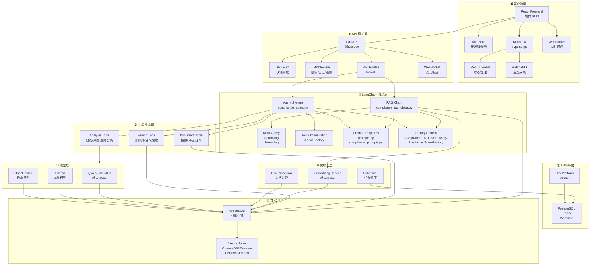
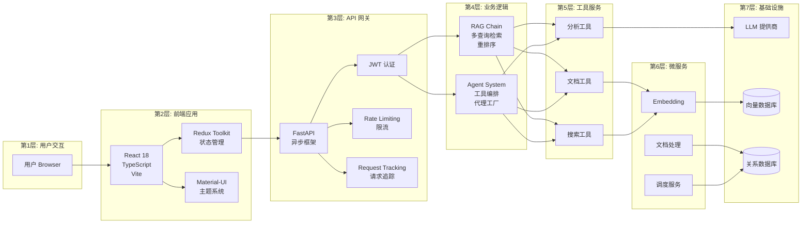
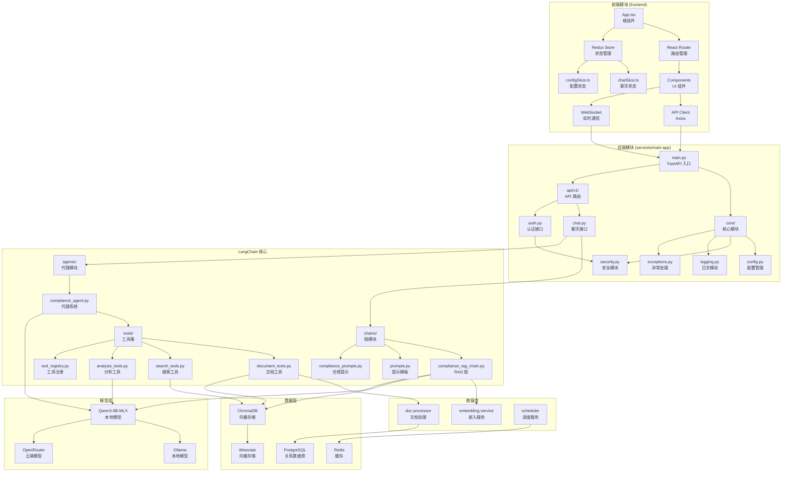
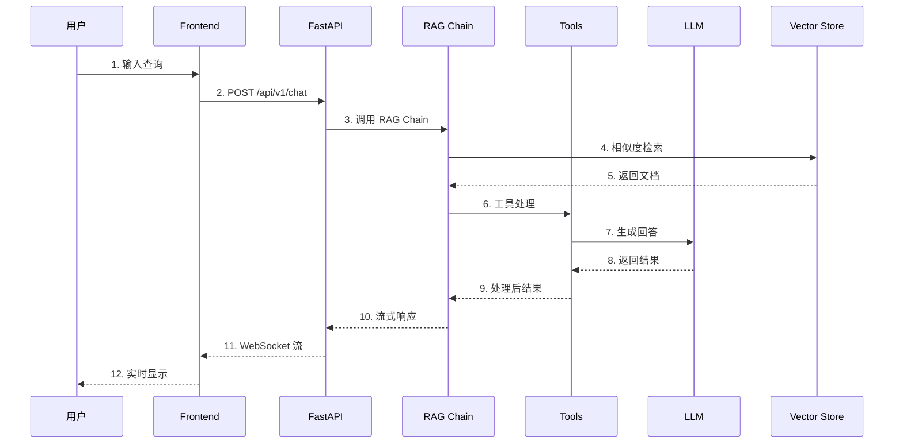
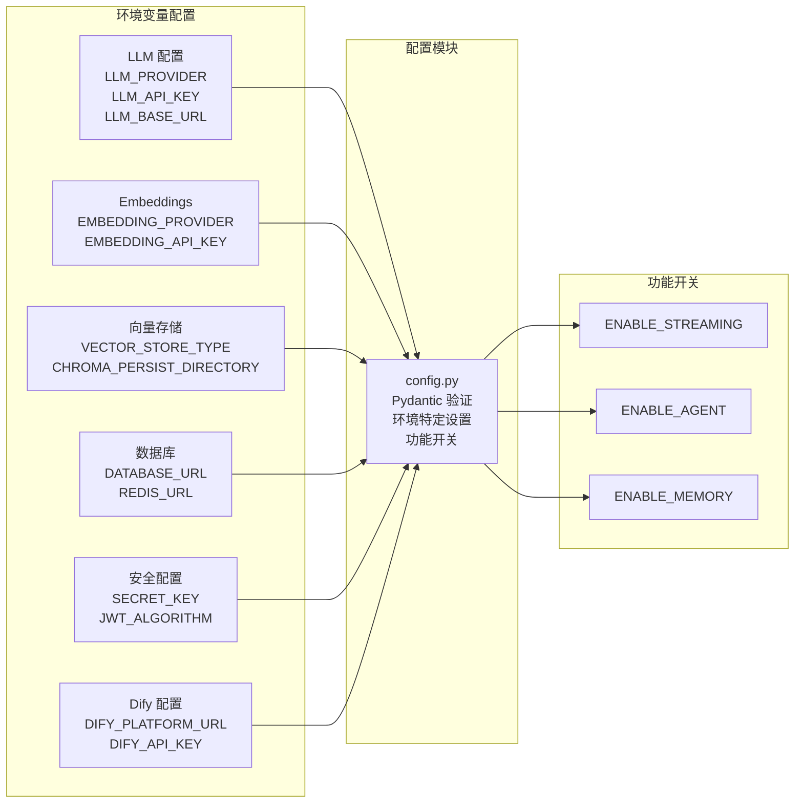
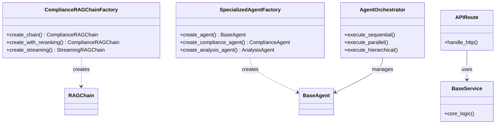
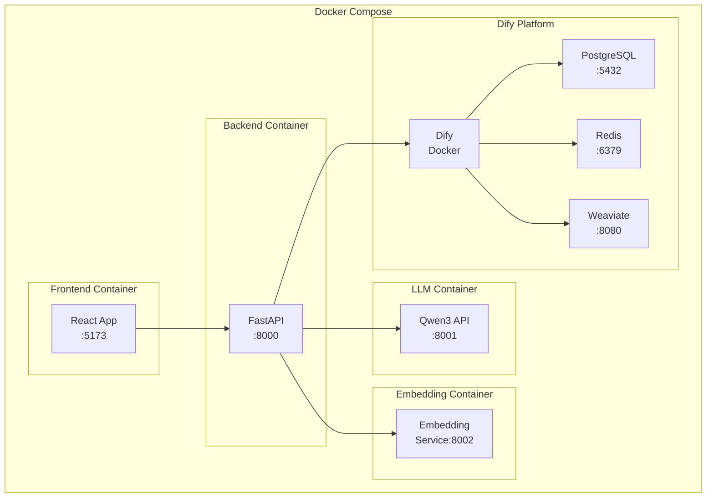
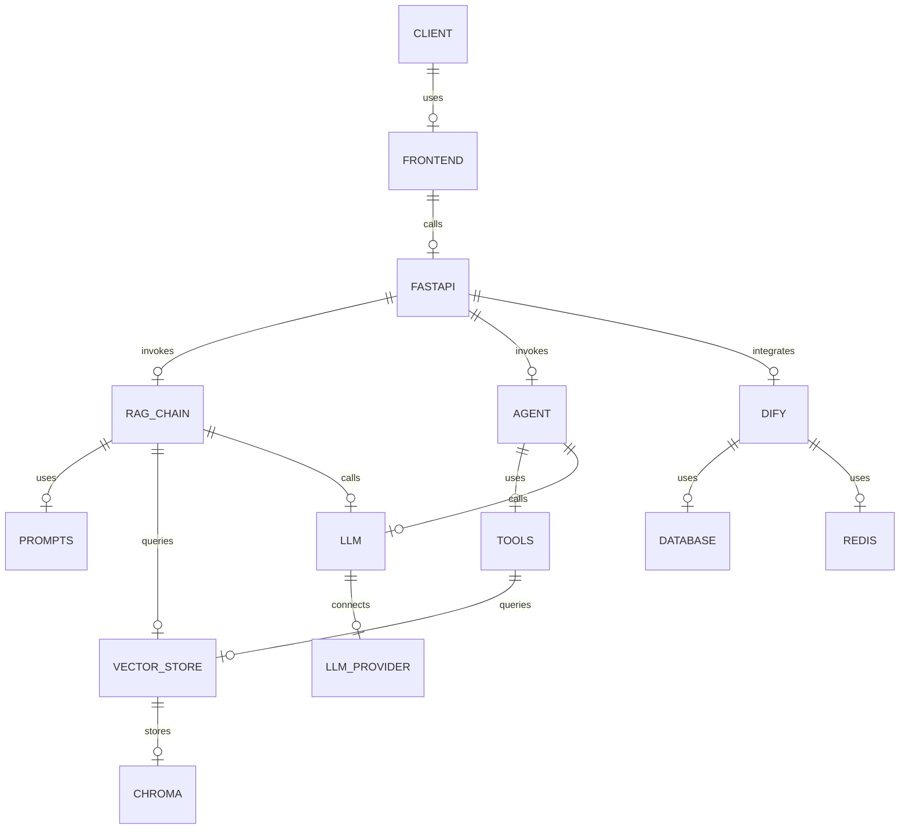
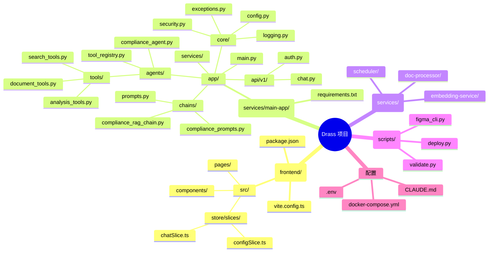

# Drass 项目架构分析与依赖关系图

## 一、项目概述

Drass 是一个混合 Dify + LangChain 合规助手平台，采用微服务架构：

- **Dify Platform**: 核心部署基础设施 (Docker Compose)
- **LangChain Implementation**: 自定义合规助手，支持 RAG 和 Agent 能力
- **Microservices Architecture**: 文档处理、嵌入和重排序的独立服务
- **Figma Integration**: UI 开发助手，集成 Figma 设计与 GitHub issues

---

## 二、系统整体架构图

---

## 三、核心依赖关系图

---

## 四、模块间依赖关系详细图

---

## 五、数据流架构图

---

## 六、配置管理依赖图

---

## 七、设计模式类图

---

## 八、Docker 部署架构图

---

## 九、实体关系图

---

## 十、项目结构树

---

## 十一、架构总结表

| 层级 | 组件 | 技术栈 | 端口 | 依赖关系 |
|------|------|--------|------|----------|
| 客户端 | React Frontend | React 18 + TypeScript + Redux + MUI | 5173 | → API 网关 |
| API 网关 | FastAPI | FastAPI + JWT + WebSocket | 8000 | → LangChain |
| 业务逻辑 | LangChain | RAG Chain + Agent System | - | → 工具层 |
| 工具生态 | Tools | Document + Search + Analysis | - | → 微服务 |
| 微服务 | Services | Embedding + Doc Processor + Scheduler | 8002+ | → 模型层 |
| 模型层 | LLM | Qwen3-8B-MLX + Ollama + OpenRouter | 8001 | → 数据层 |
| 数据层 | Storage | ChromaDB + Weaviate + PostgreSQL + Redis | - | 底层 |

### 核心设计模式

1. **Factory Pattern**: `ComplianceRAGChainFactory`, `SpecializedAgentFactory`
2. **Orchestrator Pattern**: `AgentOrchestrator` 管理多 Agent
3. **Middleware Pipeline**: 错误处理、请求追踪、限流
4. **Service Layer**: 业务逻辑与 HTTP 关注点分离