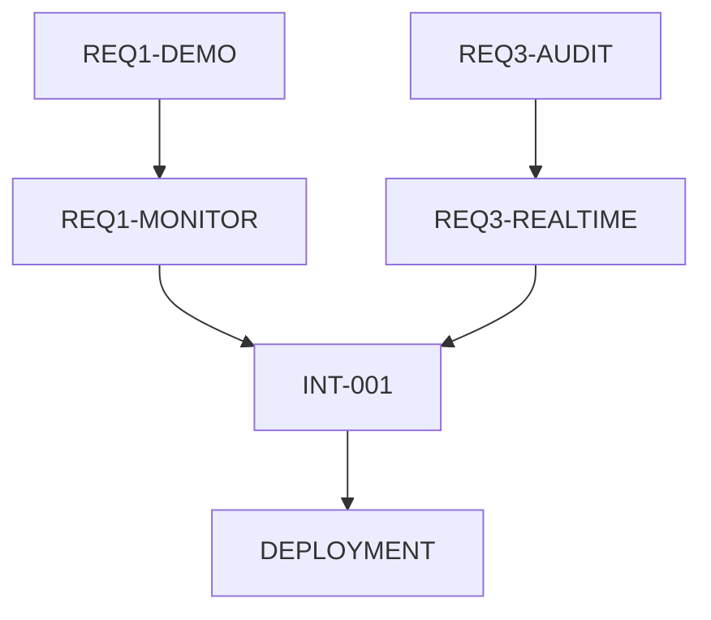

# 数据合规管理系统实现任务列表

## 项目概述

基于《数据合规管理系统实现方案.md》，本文档提供详细的任务分解和进度跟踪系统，支持自动状态更新和实时进度监控。

### 项目目标
- **需求1**：合规管理和风险识别系统（85% → 95%）
- **需求2**：文档拖拽上传功能优化（100% → 100%+）  
- **需求3**：审计日志功能完善（75% → 95%）

### 项目周期
**总计**: 6周 | **团队规模**: 5-6人 | **里程碑**: 3个主要阶段

---

## 📋 任务分解结构 (WBS)

### 🎯 阶段1：核心功能完善（第1-2周）

#### 1.1 需求1：实时数据接入演示模块

**任务ID**: `REQ1-DEMO`  
**负责人**: 后端开发工程师  
**预估工工作量**: 8工作日  
**优先级**: 高

**子任务列表**:

| 任务ID | 任务名称 | 负责人 | 工作量 | 状态 | 完成标准 |
|--------|----------|--------|--------|------|----------|
| REQ1-DEMO-001 | 创建演示数据模板 | 后端开发 | 1天 | 🔄 待开始 | 完成DEMO_DATASETS定义 |
| REQ1-DEMO-002 | 实现ComplianceDemoService | 后端开发 | 2天 | 🔄 待开始 | API接口正常响应 |
| REQ1-DEMO-003 | 开发DataIngestionDemo组件 | 前端开发 | 2天 | 🔄 待开始 | 组件渲染和交互正常 |
| REQ1-DEMO-004 | 集成合规规则引擎 | 后端开发 | 2天 | 🔄 待开始 | 规则匹配准确率>90% |
| REQ1-DEMO-005 | API接口开发和测试 | 后端开发 | 1天 | 🔄 待开始 | 接口文档和测试用例完成 |

**验收标准**:
- ✅ 支持至少3种演示数据集（个人信息、金融数据、医疗数据）
- ✅ 合规分析准确率达到90%以上
- ✅ 响应时间小于3秒
- ✅ 前端界面友好，支持实时结果展示

**自动状态更新触发条件**:
```bash
# 当以下文件创建或修改时自动更新状态
- services/main-app/app/services/compliance_demo_service.py
- services/main-app/app/data/demo_datasets.py  
- services/main-app/app/api/v1/compliance_demo.py
- frontend/src/components/ComplianceDemo/DataIngestionDemo.tsx
```

---

#### 1.2 需求3：审计日志数据源完善

**任务ID**: `REQ3-AUDIT`  
**负责人**: 全栈开发工程师  
**预估工作量**: 5工作日  
**优先级**: 高

**子任务列表**:

| 任务ID | 任务名称 | 负责人 | 工作量 | 状态 | 完成标准 |
|--------|----------|--------|--------|------|----------|
| REQ3-AUDIT-001 | 设计审计日志数据模型 | 后端开发 | 0.5天 | 🔄 待开始 | 数据库表结构设计完成 |
| REQ3-AUDIT-002 | 实现AuditService核心功能 | 后端开发 | 2天 | 🔄 待开始 | 事件捕获和存储正常 |
| REQ3-AUDIT-003 | 集成审计事件到现有API | 后端开发 | 1天 | 🔄 待开始 | 所有关键操作有审计记录 |
| REQ3-AUDIT-004 | 审计日志查询API开发 | 后端开发 | 1天 | 🔄 待开始 | 支持多维度查询和分页 |
| REQ3-AUDIT-005 | 数据库迁移和索引优化 | 后端开发 | 0.5天 | 🔄 待开始 | 查询性能满足要求 |

**验收标准**:
- ✅ 捕获所有关键操作事件（登录、上传、访问、导出等）
- ✅ 日志查询响应时间<1秒
- ✅ 支持按时间、用户、事件类型等维度筛选
- ✅ 日志数据完整性和一致性

**自动状态更新触发条件**:
```bash
# 当以下文件创建或修改时自动更新状态
- services/main-app/app/services/audit_service.py
- services/main-app/app/models/audit_log.py
- services/main-app/app/api/v1/audit.py
```

---

### 🚀 阶段2：高级功能开发（第3-4周）

#### 2.1 需求1：动态监控预警系统

**任务ID**: `REQ1-MONITOR`  
**负责人**: 全栈开发工程师  
**预估工作量**: 10工作日  
**优先级**: 中

**子任务列表**:

| 任务ID | 任务名称 | 负责人 | 工作量 | 状态 | 完成标准 |
|--------|----------|--------|--------|------|----------|
| REQ1-MONITOR-001 | ComplianceMonitoringService开发 | 后端开发 | 3天 | 🔄 待开始 | 监控指标计算准确 |
| REQ1-MONITOR-002 | 实时监控WebSocket服务 | 后端开发 | 2天 | 🔄 待开始 | 支持多客户端连接 |
| REQ1-MONITOR-003 | RealTimeMonitor前端组件 | 前端开发 | 3天 | 🔄 待开始 | 实时数据展示正常 |
| REQ1-MONITOR-004 | 告警规则引擎开发 | 后端开发 | 1.5天 | 🔄 待开始 | 告警准确率>95% |
| REQ1-MONITOR-005 | 监控面板集成测试 | 测试工程师 | 0.5天 | 🔄 待开始 | 功能测试通过 |

**验收标准**:
- ✅ 实时监控关键合规指标
- ✅ 支持自定义告警阈值
- ✅ WebSocket连接稳定，延迟<100ms
- ✅ 监控面板响应式设计，支持移动端

---

#### 2.2 需求2：文档处理优化

**任务ID**: `REQ2-OPTIMIZE`  
**负责人**: 前端+后端开发工程师  
**预估工作量**: 8工作日  
**优先级**: 中

**子任务列表**:

| 任务ID | 任务名称 | 负责人 | 工作量 | 状态 | 完成标准 |
|--------|----------|--------|--------|------|----------|
| REQ2-OPT-001 | BatchUploadProgress组件开发 | 前端开发 | 2天 | 🔄 待开始 | 批量上传进度可视化 |
| REQ2-OPT-002 | DocumentPreprocessor服务 | 后端开发 | 3天 | 🔄 待开始 | 支持多格式文档处理 |
| REQ2-OPT-003 | 敏感信息检测算法 | 后端开发 | 2天 | 🔄 待开始 | 检测准确率>90% |
| REQ2-OPT-004 | 文档预览功能 | 前端开发 | 1天 | 🔄 待开始 | 支持主要文档格式预览 |

**验收标准**:
- ✅ 批量上传支持>100个文件
- ✅ 敏感信息检测覆盖身份证、手机号、邮箱等
- ✅ 文档处理时间<10秒/MB
- ✅ 预览功能支持PDF、DOCX、TXT格式

---

#### 2.3 需求3：实时日志推送系统

**任务ID**: `REQ3-REALTIME`  
**负责人**: 全栈开发工程师  
**预估工作量**: 6工作日  
**优先级**: 高

**子任务列表**:

| 任务ID | 任务名称 | 负责人 | 工作量 | 状态 | 完成标准 |
|--------|----------|--------|--------|------|----------|
| REQ3-RT-001 | AuditWebSocketManager开发 | 后端开发 | 2天 | 🔄 待开始 | WebSocket连接管理正常 |
| REQ3-RT-002 | 前端AccessLogs组件增强 | 前端开发 | 2天 | 🔄 待开始 | 实时更新和筛选功能 |
| REQ3-RT-003 | 日志导出功能 | 后端开发 | 1天 | 🔄 待开始 | 支持Excel/CSV导出 |
| REQ3-RT-004 | 实时通知系统 | 前端开发 | 1天 | 🔄 待开始 | 安全事件实时提醒 |

**验收标准**:
- ✅ 日志实时推送延迟<500ms
- ✅ 支持多种格式导出
- ✅ 实时通知功能正常
- ✅ 连接断线自动重连

---

### 🔧 阶段3：系统优化和部署（第5-6周）

#### 3.1 集成测试和性能优化

**任务ID**: `INTEGRATION-TEST`  
**负责人**: 测试工程师+DevOps工程师  
**预估工作量**: 8工作日  
**优先级**: 高

**子任务列表**:

| 任务ID | 任务名称 | 负责人 | 工作量 | 状态 | 完成标准 |
|--------|----------|--------|--------|------|----------|
| INT-001 | 端到端功能测试 | 测试工程师 | 3天 | 🔄 待开始 | 所有功能测试通过 |
| INT-002 | 性能压力测试 | 测试工程师 | 2天 | 🔄 待开始 | 支持100并发用户 |
| INT-003 | 安全测试和漏洞扫描 | 安全工程师 | 2天 | 🔄 待开始 | 无高危漏洞 |
| INT-004 | 数据库性能优化 | 后端开发 | 1天 | 🔄 待开始 | 查询响应时间<2秒 |

---

#### 3.2 部署和上线

**任务ID**: `DEPLOYMENT`  
**负责人**: DevOps工程师  
**预估工作量**: 2工作日  
**优先级**: 高

**子任务列表**:

| 任务ID | 任务名称 | 负责人 | 工作量 | 状态 | 完成标准 |
|--------|----------|--------|--------|------|----------|
| DEP-001 | 生产环境配置 | DevOps | 1天 | 🔄 待开始 | 环境配置正确 |
| DEP-002 | 数据迁移和备份 | DevOps | 0.5天 | 🔄 待开始 | 数据迁移成功 |
| DEP-003 | 监控和日志配置 | DevOps | 0.5天 | 🔄 待开始 | 监控告警正常 |

---

## 🤖 自动状态更新系统

### 实现方案

**1. 文件监控机制**
```bash
#!/bin/bash
# scripts/task-status-monitor.sh

# 监控关键文件变化
inotifywait -m -r --format '%w%f %e' \
  services/main-app/app/services/ \
  services/main-app/app/api/ \
  frontend/src/components/ | while read file event
do
  # 根据文件路径自动更新任务状态
  python scripts/update_task_status.py "$file" "$event"
done
```

**2. 自动状态更新脚本**
```python
# scripts/update_task_status.py
import os
import json
from datetime import datetime

# 文件路径到任务ID的映射
FILE_TASK_MAPPING = {
    'compliance_demo_service.py': 'REQ1-DEMO-002',
    'demo_datasets.py': 'REQ1-DEMO-001',
    'DataIngestionDemo.tsx': 'REQ1-DEMO-003',
    'audit_service.py': 'REQ3-AUDIT-002',
    'audit_log.py': 'REQ3-AUDIT-001',
    # ... 更多映射
}

def update_task_status(file_path, event):
    """根据文件变化自动更新任务状态"""
    filename = os.path.basename(file_path)
    
    if filename in FILE_TASK_MAPPING:
        task_id = FILE_TASK_MAPPING[filename]
        
        if event in ['CREATE', 'MODIFY']:
            # 检查文件内容完整性
            if is_task_completed(file_path, task_id):
                update_status(task_id, 'completed')
            else:
                update_status(task_id, 'in_progress')

def is_task_completed(file_path, task_id):
    """检查任务是否完成"""
    # 根据任务ID检查特定的完成条件
    completion_checks = {
        'REQ1-DEMO-002': check_compliance_demo_service,
        'REQ3-AUDIT-002': check_audit_service,
        # ... 更多检查函数
    }
    
    if task_id in completion_checks:
        return completion_checks[task_id](file_path)
    
    return False

def update_status(task_id, status):
    """更新任务状态到状态文件"""
    status_file = '.cursor/task_status.json'
    
    # 读取当前状态
    with open(status_file, 'r') as f:
        status_data = json.load(f)
    
    # 更新状态
    status_data[task_id] = {
        'status': status,
        'updated_at': datetime.now().isoformat()
    }
    
    # 写回文件
    with open(status_file, 'w') as f:
        json.dump(status_data, f, indent=2)
    
    print(f"任务 {task_id} 状态已更新为: {status}")
```

**3. 实时进度展示**
```typescript
// frontend/src/components/TaskTracker/TaskProgressDashboard.tsx
export const TaskProgressDashboard: React.FC = () => {
  const [taskStatus, setTaskStatus] = useState<TaskStatus>({});
  
  useEffect(() => {
    // WebSocket连接获取实时任务状态
    const ws = new WebSocket(`${getApiUrl('wsUrl')}/task-status`);
    
    ws.onmessage = (event) => {
      const data = JSON.parse(event.data);
      setTaskStatus(data.taskStatus);
    };
    
    return () => ws.close();
  }, []);
  
  return (
    <Grid container spacing={3}>
      <Grid item xs={12}>
        <TaskOverviewCard 
          totalTasks={Object.keys(taskStatus).length}
          completedTasks={getCompletedCount(taskStatus)}
          inProgressTasks={getInProgressCount(taskStatus)}
        />
      </Grid>
      
      {Object.entries(taskStatus).map(([taskId, status]) => (
        <Grid item xs={12} md={6} key={taskId}>
          <TaskCard
            taskId={taskId}
            status={status.status}
            updatedAt={status.updated_at}
            progress={calculateProgress(taskId, status)}
          />
        </Grid>
      ))}
    </Grid>
  );
};
```

---

## 📊 进度跟踪仪表板

### 关键指标

| 指标 | 当前值 | 目标值 | 状态 |
|------|--------|--------|------|
| 总任务数 | 28 | 28 | - |
| 已完成任务 | 0 | 28 | 🔄 0% |
| 进行中任务 | 0 | - | 🔄 0% |
| 待开始任务 | 28 | 0 | 🔄 100% |

### 里程碑进度

| 里程碑 | 计划完成时间 | 实际完成时间 | 状态 |
|--------|--------------|--------------|------|
| 阶段1：核心功能完善 | 第2周末 | - | 🔄 待开始 |
| 阶段2：高级功能开发 | 第4周末 | - | 🔄 待开始 |
| 阶段3：系统优化部署 | 第6周末 | - | 🔄 待开始 |

---

## 🚨 风险管理

### 高风险任务

| 任务ID | 风险等级 | 风险描述 | 应对措施 |
|--------|----------|----------|----------|
| REQ1-MONITOR | 高 | WebSocket实时性能要求 | 提前进行压力测试 |
| REQ3-RT | 中 | 日志数据量大可能影响性能 | 分页加载和数据归档 |
| INT-002 | 高 | 并发性能测试可能不达标 | 预留性能优化时间 |

### 依赖关系



---

## 📝 使用说明

### 1. 启动自动监控
```bash
# 启动文件监控服务
./scripts/task-status-monitor.sh

# 启动实时状态服务器
python scripts/task_status_server.py
```

### 2. 查看实时进度
- 访问前端仪表板：`http://localhost:5173/task-dashboard`
- 查看状态文件：`.cursor/task_status.json`
- 命令行查询：`python scripts/check_progress.py`

### 3. 手动更新状态
```bash
# 手动标记任务完成
python scripts/update_task_status.py --task-id REQ1-DEMO-001 --status completed

# 添加任务备注
python scripts/update_task_status.py --task-id REQ1-DEMO-001 --note "数据模板定义完成"
```

---

## 📞 联系方式

**项目经理**: 负责整体进度协调  
**技术负责人**: 负责技术方案评审  
**测试负责人**: 负责质量保证  

**每日站会**: 上午9:30  
**周报提交**: 每周五下午5点  
**里程碑评审**: 每个阶段结束后

---

*本任务列表将根据项目进展实时更新，请定期查看最新版本。*

